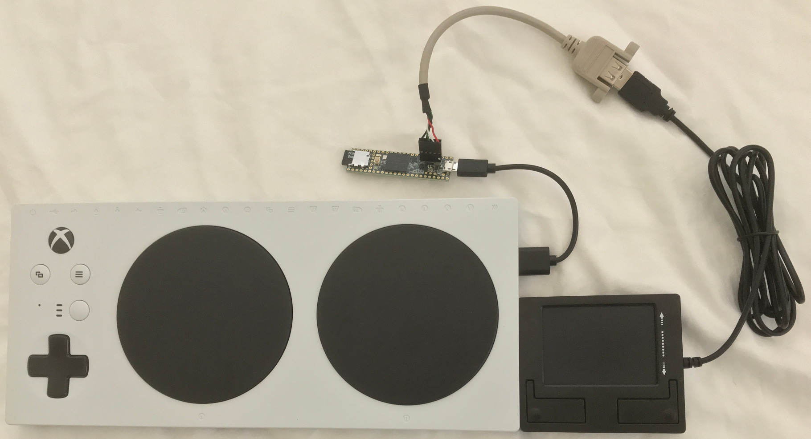

# Mouse to Joystick for Xbox Adaptive Controller

The Microsoft Xbox Adaptive Controller (XAC) ignores all USB HID devices except
for joysticks. This project converts USB HID mouse messages into USB HID
joystick messages. This allows the use of USB mice, track balls, and some
touchpads. For example,
[this](https://perixx.com/perixx-peripad-501ii-wired-usb-touchpad-black-86x75x11mm-dimension-fit-with-industrial-professional-use.html)
small touchpad works. Large touchpads usually require custom device drivers
so are not USB HID mouse compatible so will not work with this project.

NOTE: Using joysticks, keyboards, mice, track balls, etc. with consoles is not
new. If you do not need the XAC for button and switch inputs, consider the
following alternatives. Or use one of the following with an XAC if you do not
want to bother with building this project. I have not used any of them so you
will have to investigate on your own.

* The [GIMX](https://gimx.fr) open source project.
* [CronusMax](https://cronusmax.com/)
* [Titan Two](https://www.consoletuner.com/)
* [Xim APEX](https://xim.tech/)



## Features

* Mouse/track ball/touch pad movement maps to the right thumbstick.
* Primary/Left mouse button maps to gamepad X button.
* Secondary/Right mouse button maps to gamepad Y button.
* If present, third button maps to gamepad Right Bumper.
* If present, fourth button maps to gamepad Right Stick.
* The button mapping can be change by a configuration file stored on a micro SD card.

## Configuration file on micro SD card

Create a file on a micro SD card at the top level with the name MSE2JOY.JSN
and put the following three lines in the file.

Default button mapping.
```
{
 "mapMouseButtons": [ 4, 5, 3, 2, 6, 7, 0, 1 ]
}
```

Xbox Button Name| Xbox Button Number
----------------|-------------------
View            | 0
Menu            | 1
right stick     | 2
right bumper    | 3
X               | 4
Y               | 5
X1              | 6
X2              | 7

The default mapping means the first mouse button (usually the primary/left
button) maps to the Xbox button 4 which is the X button. The second mouse
button (usually the secondary/right button) maps to the Xbox button 5 which is
the Y button.

## Hardware components

* 1 x PJRC Teensy 3.6 board (t36)
* 1 x PJRC USB host cable
* 1 x USB mouse, track ball, touch pad, etc. of your choice
* Breadboard, headers, wire, etc.

The only soldering required is to attach the 5 pin header for the USB host
cable. The other pins are not used.

## Software

* mouse2joy -- Mouse to joystick converter

## Software build enviroment

### Arduino IDE 1.8.7 and Teensyduino 1.44

* Install Arduino IDE 1.8.7. Follow the instructions at arduino.cc.
* Install TeensyDuino 1.44. Follow the instructions at pjrc.com.
* Install the ArduinoJson library using library manager. Use the latest 5.x
  version which is 5.13.3 as of this writing. Do not use the 6.x beta version.
* Unzip the patches for the joystick (joystick_teensy_20181201.zip) over the
  TeensyDuino files.
* Set the board type to Teensy 3.6 and the USB Type to Joystick + Serial. The
  joystick options with keyboard and mouse do not work with the XAC.
* Upload mouse2joy.ino to the t36.

### Arduino IDE 1.8.8 and Teensyduino 1.45

* Install Arduino IDE 1.8.8. Follow the instructions at arduino.cc.
* Install TeensyDuino 1.45. Follow the instructions at pjrc.com.
* Install the ArduinoJson library using library manager. Use the latest 5.x
  version which is 5.13.3 as of this writing. Do not use the 6.x beta version.
* Unzip the patches for the joystick (joystick_teensy_1.45_20181212.zip) over
  the TeensyDuino files.
* Set the board type to Teensy 3.6 and the USB Type to Joystick + Serial. The
  joystick options with keyboard and mouse do not work with the XAC.
* Upload mouse2joy.ino to the t36.


## How to use it

Plug the mouse, track ball, touchpad, etc. into the t36 USB host cable. Plug
the t36 into the XAC right USB port using a micro USB cable. Moving the mouse
should now be equivalent to moving the right thumb stick. If the device
requires more power than the XAC can provide, unplug the mouse and plug a
powered USB hub into the t36 USB host port. Plug the mouse into the powered
hub. This is necessary for a Kensington Expert track ball. Other large devices
or devices with LEDs may also require extra power. Another possible solution is
to use the optional XAC power supply.
